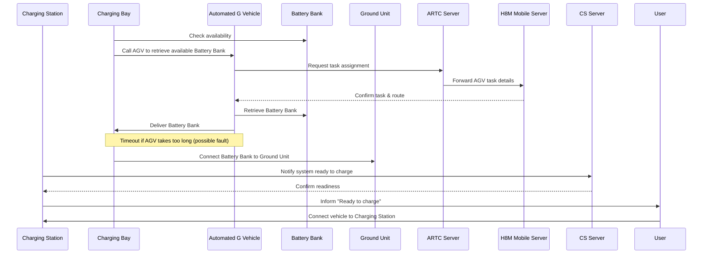

```mermaid
sequenceDiagram
    %% Participants
    participant CS as Charging Station
    participant CB as Charging Bay
    participant AGV as Automated G Vehicle
    participant BB as Battery Bank
    participant GU as Ground Unit
    participant ARTC as ARTC Server
    participant H8M as H8M Mobile Server
    participant CSS as CS Server

    %% Step 1: Check & Retrieve Battery Bank
    CB->>BB: Check availability
    CB->>AGV: Call AGV to retrieve available Battery Bank
    AGV->>ARTC: Request task assignment
    ARTC->>H8M: Forward AGV task details
    H8M-->>AGV: Confirm task & route
    AGV->>BB: Retrieve Battery Bank

    %% Step 2: Deliver & Connect
    AGV->>CB: Deliver Battery Bank
    Note over AGV,CB: Timeout if AGV takes too long (possible fault)
    CB->>GU: Connect Battery Bank to Ground Unit
    CS->>CSS: Notify system ready to charge
    CSS-->>CS: Confirm readiness
    CS->>User: Inform "Ready to charge"
    User->>CS: Connect vehicle to Charging Station

```

